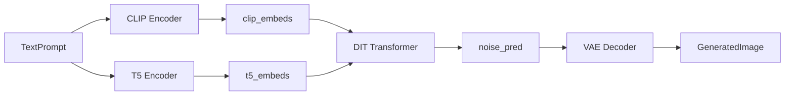

# Data Model: FLUX to Triton Conversion

## Core Entities

### TextPrompt
텍스트 입력을 나타내는 엔티티
- **prompt**: str - 주요 텍스트 프롬프트
- **prompt_2**: Optional[str] - T5 인코더용 보조 프롬프트 (기본값: prompt와 동일)
- **max_sequence_length**: int - T5 토큰 최대 길이 (기본값: 512)
- **batch_size**: int - 배치 크기

### PromptEmbeddings
텍스트 인코딩 결과를 나타내는 엔티티
- **clip_embeds**: torch.Tensor - CLIP pooled embeddings (batch_size, 768)
- **t5_embeds**: torch.Tensor - T5 sequence embeddings (batch_size, seq_len, 4096)
- **text_ids**: torch.Tensor - 텍스트 위치 ID (seq_len, 3)

### LatentTensor
잠재 공간 텐서를 나타내는 엔티티
- **latents**: torch.Tensor - 패킹된 잠재 벡터 (batch_size, num_patches, 64)
- **latent_image_ids**: torch.Tensor - 이미지 위치 ID (num_patches, 3)
- **timestep**: torch.Tensor - 현재 타임스텝 (batch_size,)
- **guidance**: torch.Tensor - 가이던스 스케일 (batch_size,)

### GeneratedImage
최종 생성된 이미지를 나타내는 엔티티
- **images**: torch.Tensor - RGB 이미지 (batch_size, 3, height, width)
- **height**: int - 이미지 높이
- **width**: int - 이미지 너비
- **output_type**: str - 출력 형식 ("pil" | "numpy" | "tensor")

### InferenceRequest
전체 추론 요청을 나타내는 엔티티
- **prompt**: Union[str, List[str]] - 입력 텍스트
- **num_inference_steps**: int - 추론 스텝 수 (기본값: 4)
- **guidance_scale**: float - 가이던스 강도 (기본값: 0.0)
- **num_images_per_prompt**: int - 프롬프트당 이미지 수 (기본값: 1)
- **height**: Optional[int] - 출력 이미지 높이
- **width**: Optional[int] - 출력 이미지 너비
- **generator**: Optional[torch.Generator] - 랜덤 시드

## Tensor Shape Specifications

### Input Tensors
```python
# Text prompts (variable)
text_input: List[str]  # ["prompt1", "prompt2", ...]

# CLIP tokenizer output
clip_input_ids: torch.Tensor  # (batch_size, 77) dtype=int64

# T5 tokenizer output
t5_input_ids: torch.Tensor  # (batch_size, 512) dtype=int64
```

### Intermediate Tensors
```python
# CLIP embeddings
clip_embeds: torch.Tensor  # (batch_size, 768) dtype=float32

# T5 embeddings
t5_embeds: torch.Tensor  # (batch_size, 512, 4096) dtype=float32

# Text position IDs
text_ids: torch.Tensor  # (512, 3) dtype=float32

# Packed latents
latents: torch.Tensor  # (batch_size, num_patches, 64) dtype=float32
# where num_patches = (height//16) * (width//16)

# Image position IDs
latent_image_ids: torch.Tensor  # (num_patches, 3) dtype=float32

# Timestep tensor
timestep: torch.Tensor  # (batch_size,) dtype=float32

# Guidance tensor
guidance: torch.Tensor  # (batch_size,) dtype=float32
```

### Output Tensors
```python
# Noise prediction
noise_pred: torch.Tensor  # (batch_size, num_patches, 64) dtype=float32

# Final images
images: torch.Tensor  # (batch_size, 3, height, width) dtype=float32
```

## Data Flow Relationships

### BLS Orchestrator
- **Input**: InferenceRequest
- **Outputs**: 각 모델로 분산된 요청들
- **State Management**: 배치 상태, 에러 복구

### CLIP → T5 → DIT → VAE Pipeline


### DIT Loop Execution
DIT 모델은 num_inference_steps만큼 반복 호출됩니다:
```python
for timestep in timesteps:  # 4회 반복 (기본값)
    noise_pred = dit_model(
        latents=latents,
        timestep=timestep,
        clip_embeds=clip_embeds,
        t5_embeds=t5_embeds,
        guidance=guidance
    )
    latents = scheduler.step(noise_pred, timestep, latents)
```

## Validation Rules

### Input Validation
- prompt는 비어있지 않은 문자열 또는 문자열 리스트
- height, width는 16의 배수 (VAE 스케일 팩터 고려)
- num_inference_steps > 0
- guidance_scale >= 0.0

### Tensor Shape Validation
- 모든 batch dimension은 일치해야 함
- latents의 spatial dimension은 (height//16, width//16)와 일치
- embedding dimension은 고정 (CLIP: 768, T5: 4096)

### Memory Constraints
- 단일 파일 500줄 이하 (헌장 준수)
- DLPack 사용으로 GPU-CPU 메모리 복사 최소화
- 배치 크기에 따른 메모리 사용량 예측 가능

## Error Handling

### Graceful Degradation
- DLPack 미지원 환경에서 일반 텐서 복사로 대체
- GPU 메모리 부족 시 배치 크기 자동 감소
- 모델 로딩 실패 시 명확한 에러 메시지

### Recovery Mechanisms
- 중간 결과 캐싱으로 부분 재시작 지원
- 타임아웃 발생 시 현재까지 결과 반환
- 메모리 누수 방지를 위한 자동 정리